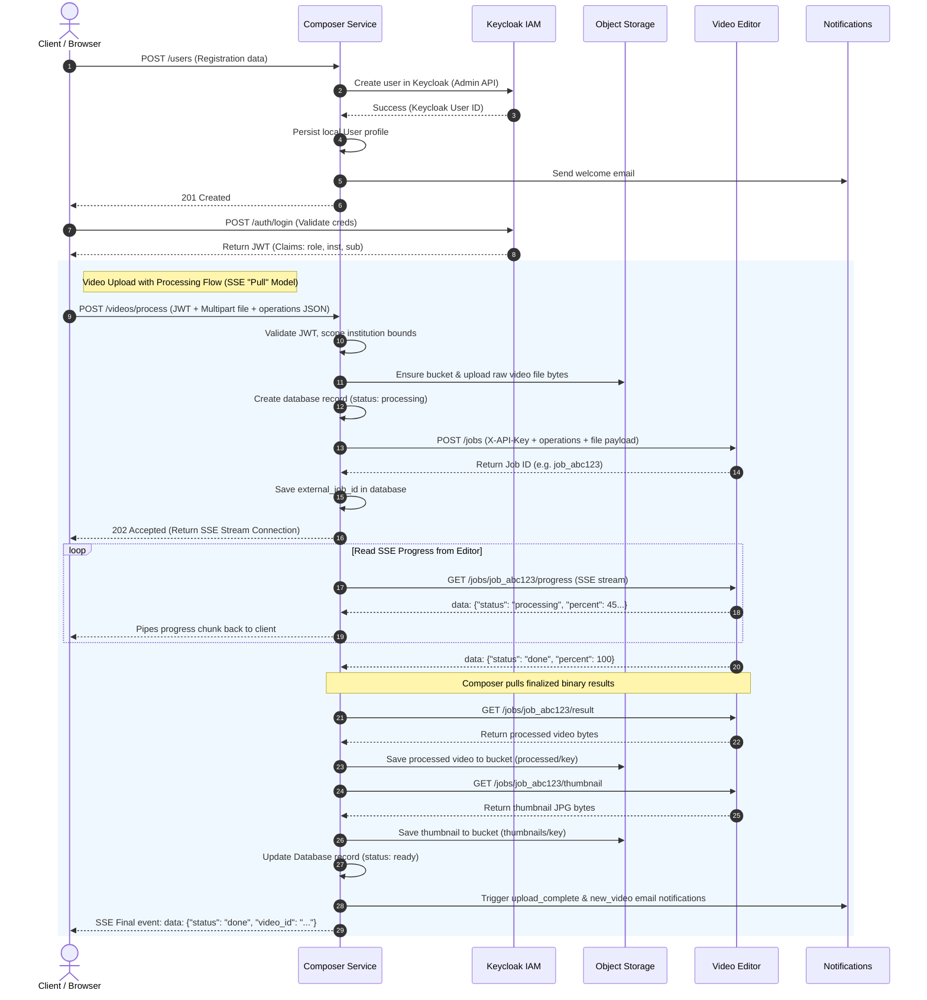
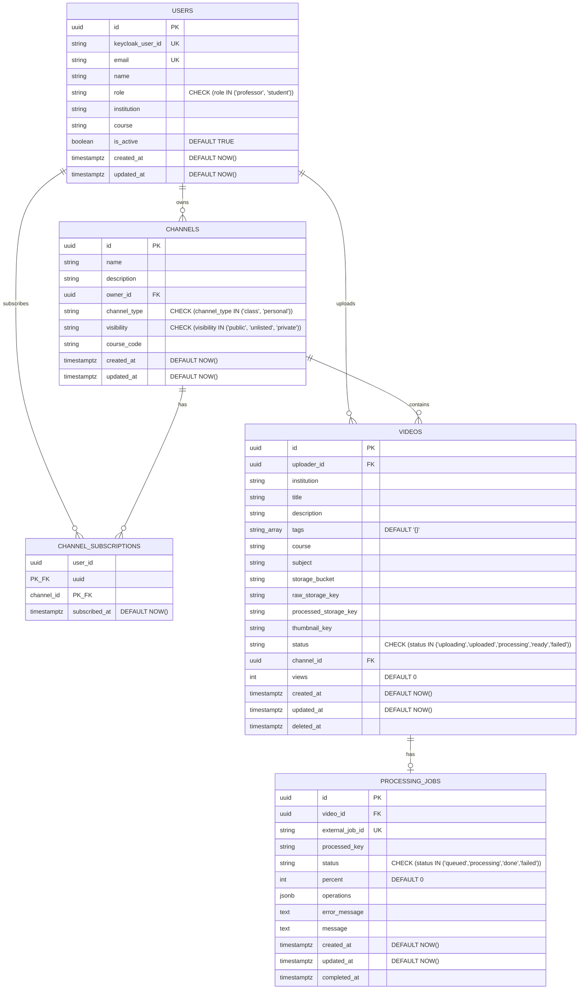

# Composer Service

Composer is the application and orchestration service for UAStream. It serves the web UI, handles authentication, owns the main platform API, and coordinates IAM, storage, video processing, and notifications.

## Role In The Stack

Composer is the only service that should orchestrate cross-service business flows. It is responsible for turning user actions into the right sequence of calls to Keycloak, Object Storage, Video Editor, and Notifications.

Public access goes through Traefik on `http://uastream.com`. Composer is exposed there as the main application entrypoint.

Composer also owns the user-facing navigation model: pages, authenticated session handling, channel ownership, uploads, and the SSE bridge used during processing.

## Responsibilities

- Serves the UAStream pages (`/`, `/library`, `/watch/<video_id>`, `/upload`, `/auth`)
- Handles login and registration flows with Keycloak
- Creates users through the Keycloak admin API
- Validates JWTs for protected API routes
- Enforces ownership and role checks
- Uploads raw media to Object Storage
- Creates and monitors Video Editor jobs
- Persists platform metadata in PostgreSQL
- Sends email notifications through the Notifications service
- Generates stream URLs for playback

## Main Endpoints

### Frontend

- `GET /` - Home page / feed.
- `GET /library` - Video library catalog.
- `GET /watch/<video_id>` - Watch video page.
- `GET /upload` - Upload page.
- `GET /studio` - Professor studio page.
- `GET /auth` - Auth page.

### Authentication

- `GET /auth/login` - Redirect browser to Keycloak login (OIDC Auth Code flow).
- `GET /auth/callback` - OIDC redirect handler for code-to-token exchanges.
- `GET /auth/logout` - Terminate Keycloak SSO session and redirect.
- `POST /auth/login` - Direct password-grant proxy (for CLI or raw logins).
- `POST /auth/refresh` - OIDC refresh-token proxy.

### Users

- `POST /users` - Register a new user in Keycloak, sync locally, and send email.
- `GET /users/me` - Fetch authenticated user profile.

### Channels

- `POST /channels` - Create a new channel.
- `PUT/PATCH /channels/<channel_id>` - Update channel details.
- `DELETE /channels/<channel_id>` - Delete a channel.
- `GET /channels` - List channels visible to the user.
- `GET /channels/<channel_id>` - Get channel metadata and videos.
- `GET /channels/<channel_id>/subscribers` - List channel subscribers.
- `POST /channels/<channel_id>/add-member` - Add user to channel.
- `POST /channels/<channel_id>/subscribe` - Toggle subscription.
- `GET /channel/<channel_id>` - Singular alias for `/channels/<channel_id>`.
- `GET /users/me/subscriptions` - List subscriber channels.
- `GET /videos/subscribed` - Videos from subscribed channels feed.

### Videos

- `POST /videos` - Upload a video directly (uploaded status).
- `POST /videos/process` - Upload and process video using the async Video Editor.
- `GET /videos/me` - List videos uploaded by the authenticated professor.
- `PATCH/PUT /videos/<video_id>` - Edit video metadata.
- `GET /videos` - Search videos scoped to the user's institution.
- `GET /videos/{video_id}` - Fetch video metadata and presigned stream URL.
- `DELETE /videos/{video_id}` - Soft-delete video.

### Internal & Observability

- `GET /internal/storage/<bucket>/<path:key>` - Proxy read to Object Storage.
- `PUT /internal/storage/<bucket>/<path:key>` - Proxy write to Object Storage.
- `POST /internal/jobs/progress` - Receive Video Editor callback progress logs.
- `GET /metrics` - Prometheus metrics scrapable endpoint.

### Route Notes

- `POST /videos/process` starts the upload-and-process flow and streams progress back to the browser.
- `GET /internal/storage/<bucket>/<path:key>` and `PUT /internal/storage/<bucket>/<path:key>` are used for service-to-service storage access.
- `POST /internal/jobs/progress` is the callback path used by the worker flow.
- `GET /metrics` exposes Prometheus metrics for the stack.

## Runtime

### Dependencies

- IAM / Keycloak
- Object Storage
- Video Editor
- Notifications
- PostgreSQL

All URLs and secrets come from environment variables in `config.py`.

### Environment Variables

- `KEYCLOAK_URL`
- `KEYCLOAK_PUBLIC_URL`
- `KEYCLOAK_REALM`
- `KEYCLOAK_CLIENT_ID`
- `KEYCLOAK_CLIENT_SECRET`
- `OBJECT_STORAGE_URL`
- `OBJECT_STORAGE_API_KEY`
- `VIDEO_EDITOR_URL`
- `VIDEO_EDITOR_API_KEY`
- `NOTIFICATIONS_URL`
- `NOTIFICATIONS_API_KEY`
- `DATABASE_URL`
- `COMPOSER_BASE_URL`
- `PORT`

### Local Run

```bash
python -m venv .venv
source .venv/bin/activate
pip install -r requirements.txt
PORT=8090 python app.py
```

Open the app at:


- `http://127.0.0.1:8090/`

## Notes

- The service is the platform entrypoint, not a worker.
- `/internal/*` routes are for service-to-service use.
- SSE is used for progress streaming during video processing.
- The local PostgreSQL database stores users, channels, videos, and job metadata.

---

## Diagrams

### 1. Central Orchestrator & SSE Pull Flow
This sequence flowchart shows how the Composer service coordinates user registration, authentication, metadata persistence, and the asynchronous video processing flow.



### 2. Local PostgreSQL Database Model (5 Tables)
This entity-relationship model represents all columns, constraints, primary/foreign keys, and indexes managed by the Composer database.



