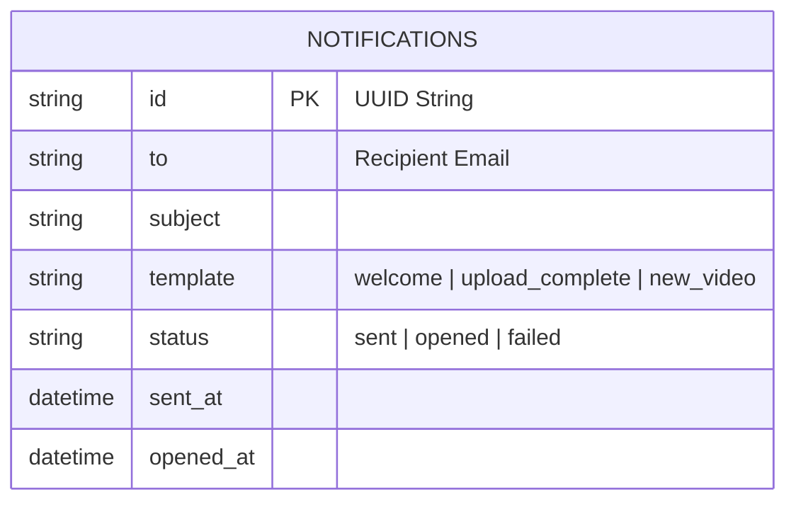

# Notifications Service

Notifications is the UAStream transactional email service. It is a small, API-key-protected worker that only sends email when Composer asks it to.

## Role In The Stack

- Composer is the only service that should call Notifications
- The service does not decide business events on its own
- It sends template-based email and records delivery/open status

## How It Works

The service accepts a recipient, subject, template name, and data payload. It stores a `Notification` record, renders the template, sends the email, and returns `202 Accepted` with a `notification_id`.

Outgoing messages include a tracking pixel so open events can be recorded best-effort. Some mail clients block external images, so open tracking is not guaranteed.

Supported template names include the built-in platform flows such as welcome, upload completion, and new video alerts.

## API Reference

### Public URL

- API docs: `http://uastream.com/openapi/swagger`
- Public tracking endpoint: `http://uastream.com/notifications/track/...`

## Endpoint Summary

- `POST /notifications/email` sends a templated email.
- `GET /notifications` lists sent notifications.
- `GET /notifications/<notification_id>` fetches one notification record.
- `GET /notifications/templates` lists available email templates.
- `GET /notifications/templates/<template>` fetches one template definition.
- `GET /notifications/track/<notification_id>.gif` records opens through the tracking pixel.
- `GET /metrics` exposes service metrics.

## Runtime

### Local Run

```bash
python -m venv .venv
source .venv/bin/activate
pip install -r requirements.txt
python app.py
```

### Docker

```bash
docker build -t notifications .
docker run -p 8080:8080 notifications
```

## Notes

- SMTP settings are provided by the stack environment, not hardcoded in the service.
- The service is reachable publicly through Traefik, but it is still treated as an internal platform component.

---

## Diagrams

### Service Architecture & Flowchart

This diagram details the Notifications service workflow, illustrating request validation, database logging, Jinja2 rendering, SMTP dispatch, and the tracking pixel open feedback loop.

```mermaid
flowchart TD
    Comp["🧠 Composer Orchestrator"]
    ClientMail["📬 Recipient Email Client"]
    
    subgraph Notifications["Notifications Container"]
        EmailAPI["POST /notifications/email\n(Verify X-API-Key)"]
        SQLStore[("📝 SQLite DB\n[notifications.db]")]
        Jinja["Jinja2 Engine\n(Loads templates/<name>.html)"]
        SMTPSender["SMTP Client\n(STARTTLS or SSL Connection)"]
        PixelTrack["GET /track/{notification_id}.gif\n(No Auth)"]
    end
    
    SMTPHost["📧 External SMTP Host\n(Gmail, etc.)"]

    Comp -->|1. POST /email {to, template, data}| EmailAPI
    EmailAPI -->|2. Create record with 'sent' status| SQLStore
    EmailAPI -->|3. Add tracking pixel URL parameter| Jinja
    Jinja -->|4. Render HTML + Plaintext| SMTPSender
    SMTPSender -->|5. Connect & sendmail| SMTPHost
    SMTPHost -->|6. Deliver email message| ClientMail
    
    ClientMail -->|7. Load embedded tracking pixel | PixelTrack
    PixelTrack -->|8. Set status = 'opened' & opened_at = NOW| SQLStore
    PixelTrack -->|9. Serve 43-byte Transparent 1x1 GIF| ClientMail
```

### SQLite Persistent Storage Schema
This single-table SQLite database tracks all sent templates and open statuses.



