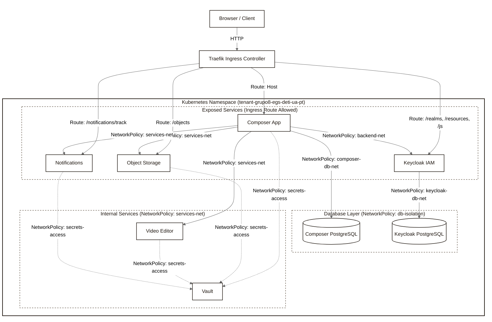

# UAStream Platform

UAStream is a teaching-focused video streaming platform for higher-education lecture content.

This repository is organized as a set of branch checkouts under `egs/branches/`. Each folder in that directory is both a git branch and a service boundary. The `main` branch is the platform entrypoint: it explains the whole system, wires the stack together, and serves as the deployment and documentation layer for the rest of the project.

## What This Repository Contains

The platform is split into five application branches plus the orchestration branch:

| Branch | Responsibility |
|---|---|
| `composer` | Public application, API gateway, and orchestration service |
| `iam` | Identity / authentication branch; intended to represent the IAM layer |
| `notifications` | Transactional email delivery service |
| `object-storage` | Binary bucket/key storage service |
| `video-editor` | Asynchronous FFmpeg processing service |
| `main` | Deployment, topology, observability, and system documentation |

The project is designed around service isolation. Each service has a narrow responsibility and communicates with the others over HTTP. The Composer is the central orchestrator for user-facing workflows.

## System Architecture

The platform follows a pull-based orchestration model:

1. The browser talks to the public entrypoints through Traefik.
2. Composer handles the user-facing API and UI.
3. Keycloak provides identity and JWT issuance.
4. Object Storage stores raw and processed media bytes.
5. Video Editor performs asynchronous media processing.
6. Notifications sends templated emails and records open tracking.
7. Composer pulls results from worker services instead of relying on callbacks from them.



## Request Flow

The most important platform flow is video upload and processing:

1. The user uploads a video to Composer.
2. Composer stores the raw file in Object Storage.
3. Composer creates a job in Video Editor and starts relaying progress as Server-Sent Events.
4. When processing finishes, Composer pulls the final video and thumbnail from Video Editor.
5. Composer stores the processed artifacts in Object Storage and updates its own database.
6. Composer sends notification emails for the relevant events.

This model keeps the worker services simple. They expose HTTP endpoints, but they do not initiate cross-service business logic themselves.

## Service Layout

### Composer

Composer is the public application service. It serves the UI, owns the main platform API, validates JWTs, creates users, manages videos and channels, and coordinates all cross-service workflows.

Key paths include:

- Frontend pages like `/`, `/library`, `/watch/<video_id>`, `/upload`, `/studio`, and `/auth`
- Authentication endpoints like `/auth/login`, `/auth/callback`, and `/auth/refresh`
- User and video APIs such as `/users`, `/users/me`, `/videos`, and `/videos/<video_id>`
- Internal orchestration paths such as `/internal/storage/<bucket>/<path:key>` and `/internal/jobs/progress`

### IAM

The IAM branch is documented as the identity layer. The code and docs in that branch currently need reconciliation, so treat it as the branch that defines authentication behavior and identity integration, not as a source of platform metadata.

### Notifications

Notifications sends templated email and tracks opens through a pixel endpoint. It is API-key protected, with the tracking pixel and metrics endpoint exposed publicly.

### Object Storage

Object Storage is the binary storage backend. It uses bucket and key paths, supports Range requests for streaming, and can return presigned download URLs.

### Video Editor

Video Editor is the async FFmpeg worker. It creates jobs, reports progress over SSE, and serves the final result and thumbnail.

## Stack Topology

The local stack is defined in [docker-compose.yml](docker-compose.yml). The most important services are:

| Service | Exposure | Purpose |
|---|---|---|
| Traefik | Public | Reverse proxy and routing layer |
| Composer | Public | Main application entrypoint |
| Keycloak | Public and internal | Identity provider |
| Object Storage | Public and internal | Direct media streaming and internal storage access |
| Notifications | Public and internal | Email delivery and tracking pixel endpoint |
| Video Editor | Internal | Processing worker |
| PostgreSQL | Internal | Composer metadata database |
| Keycloak PostgreSQL | Internal | Keycloak state |
| Vault | Internal | Secrets manager for the demo stack |
| Prometheus | Internal | Metrics collection |

The docker-compose file also shows the important network boundaries:

- `public-net` for traffic exposed through Traefik
- `services-net` for internal service-to-service calls
- `backend-net` for Vault and backend plumbing
- `composer-db-net` and `keycloak-db-net` for database isolation

## Secrets Management

The repository demonstrates Vault-based secret delivery in two forms:

- A simple dev-mode setup using static tokens
- A Vault Agent sidecar proof of concept

See [Vault Agent README](documentation/README_main_vault-agent.md) for the AppRole templates and rendered secret files used by each service.

The stack is intentionally demo-friendly. The README and compose files should be treated as a deployment guide for local development and a reference architecture for production hardening, not as a production-ready secrets blueprint.

## Documentation Map

The best place to read the actual endpoint contracts is [API_REFERENCE.md](documentation/API_REFERENCE.md).

For cluster deployment and Kubernetes topology, see [deployment_architecture.md](documentation/deployment_architecture.md).

For branch-level implementation docs, see:

- [Composer README](documentation/README_composer.md)
- [IAM README](documentation/README_iam.md)
- [Notifications README](documentation/README_notifications.md)
- [Object Storage README](documentation/README_object-storage.md)
- [Video Editor README](documentation/README_video-editor.md)
- [Grafana README](documentation/README_main_grafana.md)
- [Vault Agent README](documentation/README_main_vault-agent.md)

That reference file is the canonical endpoint inventory for the service branches and has been reconciled with the actual codebase implementations.

## Local Development

The repository is designed to be used with side-by-side branch worktrees. The helper script [run.sh](run.sh) ensures the required branch folders exist and then starts the stack.

Typical local flow:

```bash
cd main
./run.sh
```

If you want to start the stack manually, use the compose file in this directory and make sure the sibling branch folders exist first.

## Observability

The stack includes Prometheus and Grafana for metrics and dashboards. The service containers also expose their own `/metrics` endpoints where applicable. See [Grafana README](documentation/README_main_grafana.md) for the dashboard catalog and observability model.

---

## Kubernetes Deployment

The platform is deployed on the University of Aveiro DETI Kubernetes cluster under the namespace `tenant-grupo8-egs-deti-ua-pt`. The full deployment guide is in [k8s/deti_deployment_playbook.md](k8s/deti_deployment_playbook.md). This section summarises the steps.

### Prerequisites

- Active UA VPN connection (Check Point SNX)
- `/etc/hosts` entry: `193.136.82.35 uastream.com grafana.uastream.com registry.deti`
- Docker configured to allow the DETI insecure registry (`registry.deti`)
- `kubectl` configured with the namespace kubeconfig

### Image Registry

All service images are built for `linux/amd64` and pushed to the DETI internal registry:

```
registry.deti/tenant-grupo8-egs-deti-ua-pt/<service>:v1
```

To rebuild and redeploy a service:

```bash
cd egs/branches/<service>
docker build --platform linux/amd64 -t registry.deti/tenant-grupo8-egs-deti-ua-pt/<service>:v1 .
docker push registry.deti/tenant-grupo8-egs-deti-ua-pt/<service>:v1
kubectl rollout restart deployment <service>
```

### Secrets

Before applying manifests, create the `uastream-secrets` Kubernetes Secret from the template:

```bash
# Fill in real values in secrets-template.yaml, then apply:
kubectl apply -f k8s/manifests/secrets-template.yaml
```

The secret provides database credentials, SMTP configuration, Vault tokens, and service API keys to all pods via environment variables.

### Applying Manifests

Manifests are numbered and must be applied in order to satisfy dependencies:

```bash
kubectl apply -f k8s/manifests/1-databases.yaml        # PostgreSQL for Composer and Keycloak
kubectl apply -f k8s/manifests/2-vault.yaml            # Vault with auto-unsealer sidecar
kubectl apply -f k8s/manifests/3-keycloak.yaml         # Keycloak with realm import and theme
kubectl apply -f k8s/manifests/4-services.yaml         # Object Storage, Video Editor, Notifications
kubectl apply -f k8s/manifests/5-composer.yaml         # Composer app and Traefik ingress
kubectl apply -f k8s/manifests/6-monitoring.yaml       # Prometheus and Grafana
kubectl apply -f k8s/manifests/7-rbac.yaml             # Prometheus ServiceAccount and RBAC
kubectl apply -f k8s/manifests/8-network-policies.yaml # Zero-trust network segmentation
```

To apply the full stack in one command:

```bash
kubectl apply -f k8s/manifests/
```

### Verifying the Deployment

```bash
kubectl get pods
```

All pods should reach `Running` status with `RESTARTS` at 0 or close to 0. Expected pods:

| Pod | Notes |
|---|---|
| `db-0` | Composer PostgreSQL |
| `kc-db-0` | Keycloak PostgreSQL |
| `vault-*` | Vault with unsealer sidecar (2/2) |
| `keycloak-*` | Two replicas forming an Infinispan cluster |
| `composer-*` | Two replicas |
| `notifications-*` | Two replicas |
| `video-editor-*` | Single replica (stateful in-memory job store) |
| `object-storage-*` | Single replica (RWO PVC) |
| `prometheus-*` | Metrics collection |
| `grafana-*` | Dashboard UI |

### Accessing the Platform

| Service | URL | Default credentials |
|---|---|---|
| UAStream | `http://uastream.com` | Professor: `professor@ua.pt` / `professor`<br>Student: `student@ua.pt` / `student` |
| Grafana | `http://grafana.uastream.com` | `admin` / `admin` |

### Scaling Notes

| Service | Replicas | Reason |
|---|---|---|
| Composer | 2 | Stateless — safe to scale |
| Keycloak | 2 | Infinispan cluster + sticky sessions required |
| Notifications | 2 | PostgreSQL-backed — stateless between replicas |
| Video Editor | 1 | In-memory job store — not safe to scale horizontally |
| Object Storage | 1 | ReadWriteOnce PVC — cannot mount to multiple nodes |
