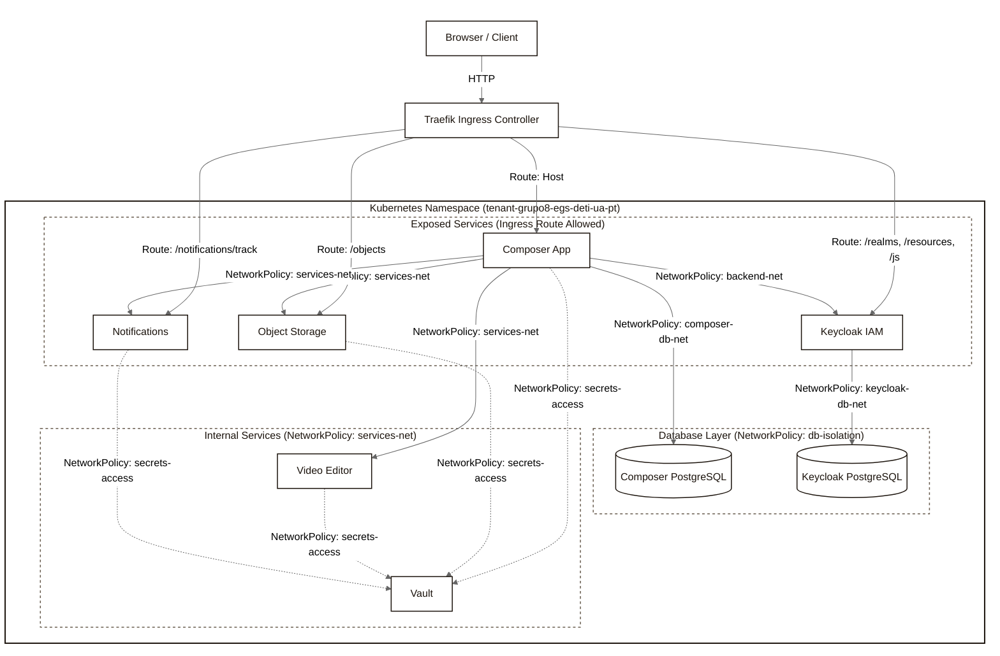

# UAStream Kubernetes Architecture & Deployment Blueprint

This document details the complete system architecture, service interactions, design patterns, and security configurations of the **UAStream Video Platform** deployed on the University Kubernetes cluster. 

The live manifests have been cleaned of internal cluster metadata and are stored as modular, turnkey files under the `/home/joaquima/egs/k8s/manifests/` directory.

---

## 🏗️ System Architecture Overview

UAStream is designed around a strictly decoupled, **service-oriented orchestration pattern**. Communication is strictly top-down to enforce service boundaries, preventing worker nodes from calling each other or sharing states.

---

## 🔒 Security & Secrets Management (HashiCorp Vault)

To enforce security compliance, **no microservice holds hardcoded credentials** or database URLs. Configuration is dynamically retrieved from **HashiCorp Vault** (`vault:8200`).

### 1. The Production-Grade Vault Lifecycle & Unsealer
* **Deployment & Storage:** Vault is deployed in production mode (`2-vault.yaml`) with a `raft` storage backend and a dedicated `PersistentVolumeClaim` (`vault-data-claim`) mounted to `/vault/data` to persist secrets.
* **Auto-Unsealer Sidecar:** Instead of a static one-shot initialization job, an auto-unsealer sidecar container (`vault-unsealer`) runs alongside the Vault server within the Vault deployment. This sidecar executes an idempotent loop:
  1. Checks if Vault is initialized. If not, initializes Vault and saves the unseal keys and root token to a Kubernetes Secret (`vault-unseal-keys`).
  2. If Vault is sealed, retrieves the unseal key from `vault-unseal-keys` and unseals Vault automatically.
  3. Boots the KV-v2 secret engine at `secret/`, provisions API keys for the worker microservices under `secret/object-storage`, `secret/video-editor`, and `secret/notifications`.
  4. Writes granular security access policies (e.g. `composer-policy` allowing read access only to relevant service keys).
* **Token Delivery:** The scoped static Vault access tokens created during bootstrapping are injected into their respective service pods from the Kubernetes `uastream-secrets` Secret.

---

## 🔐 Identity & Access Management (Keycloak)

Keycloak serves as the single source of truth for identity, authentication, and user access boundaries.

### 1. Turnkey Realm Import
Instead of configuring clients manually in the UI, a complete OIDC blueprint is defined in the ConfigMap `keycloak-realm` (`3-keycloak.yaml`).
* **Mount Path:** The `realm-egs.json` is mounted as a read-only volume inside Keycloak at `/opt/keycloak/data/import/realm-egs.json`.
* **Auto-Import:** On container startup, Keycloak reads the JSON file, provisions the `egs` realm, creates the `egs-platform` OIDC client, maps claims (roles and institution attributes), and seeds the default platform accounts (`professor@ua.pt` / `student@ua.pt`).

### 🎨 2. Custom Login Theme Mounting
Keycloak's custom login portal uses a custom branding theme named `uastream`. To bypass building custom Docker images, the theme's flat structure is stored in a ConfigMap (`keycloak-theme`) and mounted dynamically using **subPath volume mounts**:
* `theme.properties` ➡️ `/opt/keycloak/themes/uastream/login/theme.properties`
* `messages_en.properties` ➡️ `/opt/keycloak/themes/uastream/login/messages/messages_en.properties`
* `uastream.css` ➡️ `/opt/keycloak/themes/uastream/login/resources/css/uastream.css`
* `uastream.js` ➡️ `/opt/keycloak/themes/uastream/login/resources/js/uastream.js`

---

## 📡 Microservices & Routing Architecture

### 1. Ingress Traefik Routing
Traffic entering `http://uastream.com` hits the cluster's **Traefik Ingress Controller**, which evaluates the path prefixes and routes them directly to the private cluster services:
* **`/realms`**, **`/resources`**, **`/js`** ➡️ `keycloak:8080` (Direct auth redirects)
* **`/objects`** ➡️ `object-storage:8080` (Direct video stream chunking)
* **`/notifications/track`** ➡️ `notifications:8080` (Email template tracking pixel)
* **`/`** ➡️ `composer:8080` (Main app UI and API orchestrator)

### 2. Microservice Descriptions
* **Composer (`5-composer.yaml`):** The orchestrator and single point of public entry. Handles UI rendering, intercepts OIDC tokens, transfers binary video payloads, and coordinates FFmpeg processing.
* **Object Storage (`4-services.yaml`):** Agnostic binary container. Exposes simple HTTP uploads and handles range-request chunking for high-performance streaming.
* **Video Editor (`4-services.yaml`):** Ephemeral sandboxed worker. Receives a video stream, kicks off an asynchronous `ffmpeg` job, exposes a Server-Sent Events (SSE) progress endpoint, and passive-serves the finished file.
* **Notifications (`4-services.yaml`):** Flask-based template renderer. Connects to `smtp.gmail.com` using secure STARTTLS (port 587) and sends transactional platform notifications with embedded open-tracking pixels.

---

## 📈 Monitoring Stack (Prometheus & Grafana)

A clean, self-contained monitoring pipeline (`6-monitoring.yaml`) is deployed directly in the tenant namespace.

* **Prometheus:** Continuously polls and collects time-series metrics from:
  - **Keycloak** (`keycloak:9000/metrics`) - Quarkus-native JVM, HTTP, and database pool metrics.
  - **Composer, Notifications, Video-Editor, Storage** (`:8080/metrics`) - Flask/FastAPI service health, active threads, and custom event counters.
* **Grafana:** Connects natively to Prometheus and automatically loads **all 7 system dashboards** provisioned from the local filesystem:
  1. `platform_overview`
  2. `iam_keycloak`
  3. `composer_api`
  4. `notifications`
  5. `storage`
  6. `video_processing`
  7. `infrastructure_use`
* **Exposed Subdomain:** Exposes the dashboard publicly at **`http://grafana.uastream.com`** via a dedicated Ingress definition.

---

## 📂 Manifests Directory Map

The deployment manifests under `k8s/manifests/` are grouped sequentially for clean management:

| Manifest Filename | Kubernetes Resources | Description |
| :--- | :--- | :--- |
| **`secrets-template.yaml`** | `Secret` | Centralized configurations and credential variables (including database, SMTP, and Grafana credentials) for `uastream-secrets`. |
| **`1-databases.yaml`** | `StatefulSet`, `Service` | Provisions stateful PostgreSQL instances for the Composer (`db`) and Keycloak (`kc-db`) with RWO Persistent Volumes. |
| **`2-vault.yaml`** | `Deployment`, `Service`, `PersistentVolumeClaim`, `ConfigMap`, `Role`, `RoleBinding`, `ServiceAccount` | Deploys HashiCorp Vault in production mode using a Raft storage backend, PVC persistence, and a self-healing auto-unsealer sidecar container. |
| **`3-keycloak.yaml`** | `Deployment`, `Service`, `ConfigMap` | Provisions Keycloak, imports the real `egs` OIDC realm, and mounts the custom `uastream` theme. |
| **`4-services.yaml`** | `Deployment`, `Service`, `PersistentVolumeClaim` | Launches Object Storage (with local RWO volume), Video Editor (with emptyDir volume), and Notifications (with local persistent SQLite volume). |
| **`5-composer.yaml`** | `Deployment`, `Service`, `Ingress` | Deploys the main Composer gateway and Traefik ingress routing rules. |
| **`6-monitoring.yaml`** | `Deployment`, `Service`, `Ingress`, `ConfigMap` | Provisions Prometheus and Grafana (preconfigured with the 7 system dashboards). |
| **`7-rbac.yaml`** | `Role`, `RoleBinding`, `ServiceAccount` | Creates the dedicated `prometheus-sa` ServiceAccount and binds it to metrics-reading permissions. |
| **`8-network-policies.yaml`** | `NetworkPolicy` | Establishes Zero-Trust network segmentation across all pods. |
